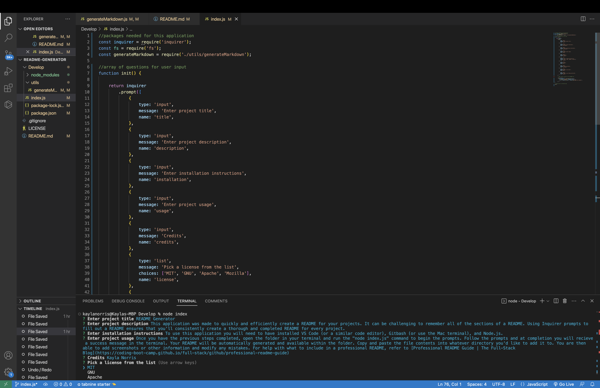
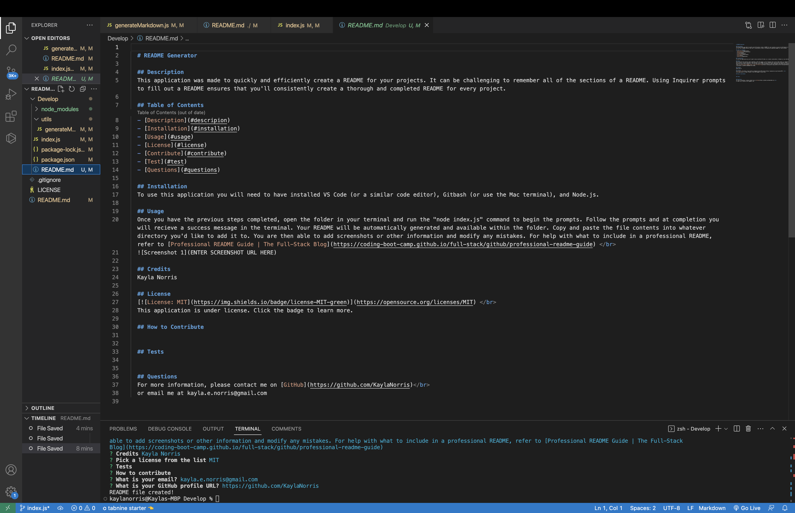

# README Generator

## Description
This application was made to quickly and efficiently create a README for your projects. It can be challenging to remember all of the sections of a README. Using Inquirer prompts to fill out a README ensures that you'll consistently create a thorough and completed README for every project.  

## Table of Contents
- [README Generator](#readme-generator)
  - [Description](#description)
  - [Table of Contents](#table-of-contents)
  - [Installation](#installation)
  - [Usage](#usage)
  - [Prompts Screenshot](#prompts-screenshot)
  - [Completed README Screenshot](#completed-readme-screenshot)
  - [Demonstration Video](#demonstration-video)
  - [License](#license)
  - [Questions](#questions)
## Installation

To use this application you will need to have installed VS Code (or a similar code editor), Gitbash (or use the Mac terminal), and Node.js.

To get started: 
- Clone the readme-generator repository by copying the link under the green code button on GitHub and running "git clone " in the terminal
- Then run the "npm init" command
- Then run the "npm install inquirer" command 

## Usage

Once you have the previous steps completed, open the folder in your terminal and run the "node index.js" command to begin the prompts. Follow the prompts and at completion you will recieve a success message in the terminal. Your README will be automatically generated and available within the folder. Copy and paste the file contents into whatever directory you'd like to add it to. You are then able to add screenshots or other information and modify any mistakes. For help with what to include in a professional README, refer to [Professional README Guide | The Full-Stack Blog](https://coding-boot-camp.github.io/full-stack/github/professional-readme-guide)

## Prompts Screenshot

## Completed README Screenshot

## Demonstration Video
[Click here to view video!](https://www.youtube.com/watch?v=Y_HPaRmcfLo)

## License

  
Please refer to the LICENSE file in the repo.

## Questions

For more information, please contact me on [GitHub](https://github.com/KaylaNorris) 
or email me at kayla.e.norris@gmail.com
